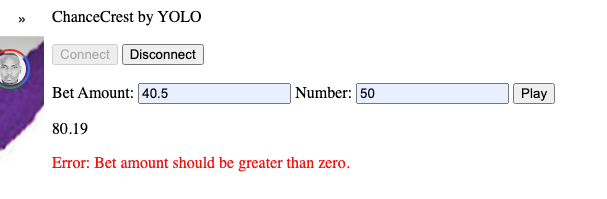
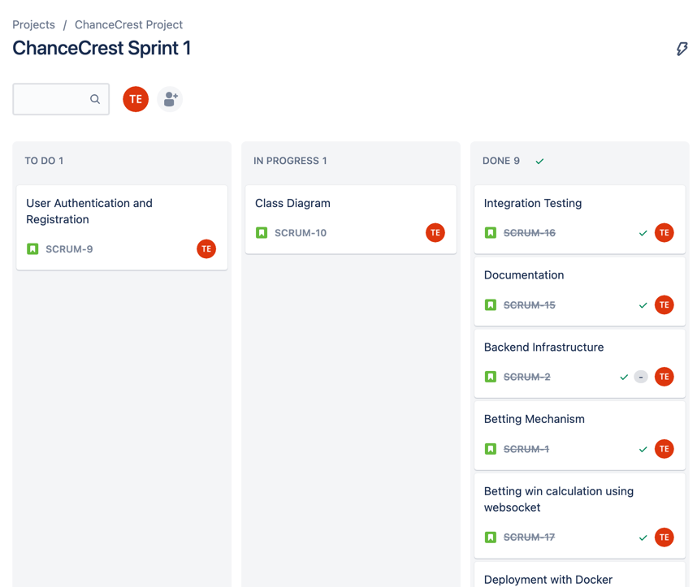

Here's a cleaner and corrected version of the provided content:

---

# ChanceCrest: by YOLO 🌊🎲



Dive into the world of number betting with ChanceCrest. Experience a seamless, thrilling gameplay that blends chance with strategy. Will fortune favor you today?

## Table of Contents

- [Features](#features)
- [Installation without Docker](#installation-without-docker)
- [Building and Running with Docker](#building-and-running-with-docker)
- [Usage](#usage)
- [Testing](#testing)
- [Project Management and Tracking](#project-management-and-tracking)

## Features

- **Intuitive Betting System**: Place bets effortlessly.
- **Fair Play Guarantee**: Advanced RNG ensures unpredictability.

## Installation without Docker

1. Clone the repository:
   ```bash
   git clone https://github.com/toluelemson/ChanceCrest.git
   ```

2. Navigate to the project directory:
   ```bash
   cd ChanceCrest
   ```

3. Install dependencies:
   ```bash
   mvn install
   ```

4. Run the Spring Boot application:
   ```bash
   mvn spring-boot:run
   ```

## Building and Running with Docker

1. Navigate to the project root and execute:
   ```bash
   mvn clean package
   ```

2. To run the packaged jar:
   ```bash
   java -jar target/chance-crest.jar
   ```

3. To build a Docker image for the application:
   ```bash
   docker build -t chance-crest .
   ```

4. To start the application using Docker Compose:
   ```bash
   docker-compose up
   ```

5. To stop the application and remove volumes:
   ```bash
   docker-compose down -v
   ```

## Usage

Once the server is running, navigate to [http://localhost:8080/](http://localhost:8080/) to access the app's frontend. Here, you can start placing bets.

## Testing

1. Navigate to the project root directory.
2. Run the tests using the following command:
   ```bash
   mvn test
   ```

Certainly! Here's the section to add to your README in Markdown format:

---

## Project Management and Tracking

Jira was used for project management. You can view the project's progress, tasks, and other related information on our [Kanban Board](https://id.atlassian.com/invite/p/jira-software?id=Z1hx25OeSSCMJW2S9FtwXQ).

